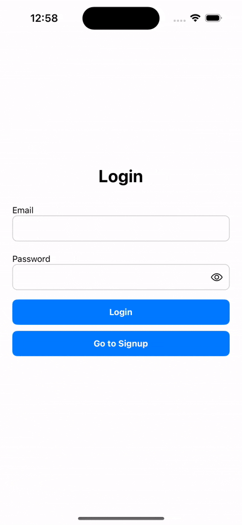

# User Authentication App

A React Native app with complete user authentication functionality including login, signup, and persistent authentication state management.

## Features

### ✅ Basic App Screens

- **Authentication Context**: Global state management using React Context API
- **Login Screen**: Email/password login with validation
- **Signup Screen**: User registration with form validation
- **Home Screen**: User profile display with logout functionality
- **Navigation**: React Navigation stack navigation
- **Persistent Auth**: AsyncStorage for maintaining login state
- **UI/UX**: Clean, modern, and responsive design

### ✅ Additional Features

- **Password Visibility Toggle**: Eye icon to show/hide password
- **Demo Account**: Quick login with demo credentials
- **Form Validation**: Real-time validation with error messages
- **Loading States**: Activity indicators during async operations
- **Alert Dialogs**: Confirmation for logout action

## Setup Instructions

### Prerequisites

- Node.js (v14 or higher)
- yarn
- React Native development environment
- iOS Simulator or Android Emulator

### Installation

1. **Clone the repository**

   ```bash
   git clone https://github.com/CTS414790/UserAuthentication.git
   cd UserAuthApp
   ```

2. **Install Dependencies**
   ```bash
   yarn install
   ```
3. **Run Expo**

   ```bash
   npx expo start
   ## Press i to run in iOS simularor
   ## Press a to run in android emulator
   ```

   ```bash
   ##To run on iOS device using yarn
   yarn ios
   ```

### Demo Account details

**User Email** : "demo@example.com"

**Password** : "password"

## Demo Video


## DemoSignup



## DemoUserPersit


